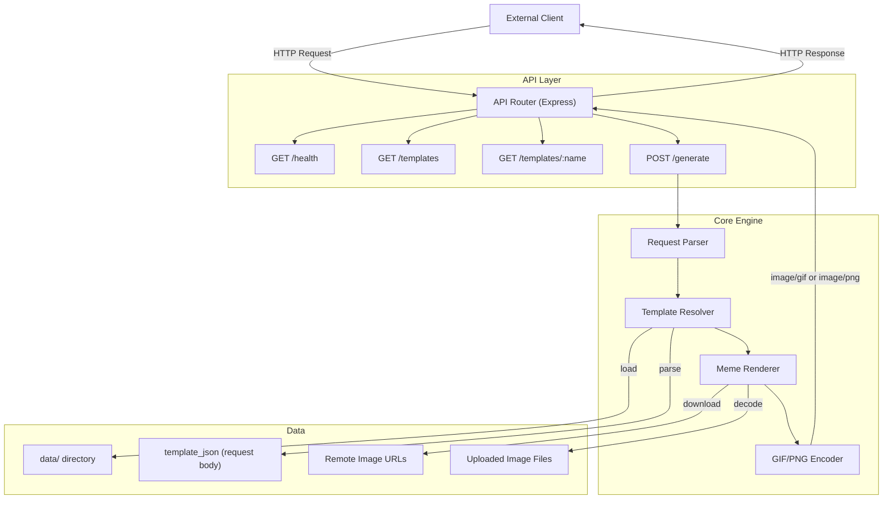

# Petpet API Service

Feature Name: petpet-api
Updated: 2026-07-30

## Description

A RESTful HTTP API service that exposes the petpet meme generation engine as a programmable interface. External applications can send images and select templates to generate petpet memes without running a browser. The service loads built-in templates from the `data/` directory, supports custom inline template JSON, and renders memes server-side using Node.js Canvas.

## Architecture



## Components and Interfaces

### API Router (Express)

Exposes HTTP endpoints and delegates to the core engine.

```
GET  /api/v1/petpet/health
GET  /api/v1/petpet/templates
GET  /api/v1/petpet/templates/:name
POST /api/v1/petpet/generate
```

### Request Parser

Parses multipart/form-data and JSON requests, extracting:
- Template selection (`template` name or `template_json`)
- Avatar images (file uploads or URL strings for `from`, `to`, `group`, `bot`)
- Text overrides (`text` JSON object)
- Rendering options (`delay`, `quality`, `bg_color`, `bg_size`)

### Template Resolver

Maintains an in-memory registry of built-in templates loaded from `data/` at startup. When `template_json` is provided, parses and validates it as an ad-hoc template.

**Template Resolution Priority:**
1. If `template_json` is provided, use it (ignore `template` field)
2. If `template` name is provided, look up in built-in templates registry
3. If neither, return 400 error

### Meme Renderer

The core rendering engine that:
1. Creates a canvas for each frame
2. Loads avatar images (from URL or upload), applies cropping, filters, transforms
3. Renders background layer
4. Draws avatar images at template-specified positions
5. Draws text overlays with template-specified styling

**Server-Side Canvas Strategy:**

Uses `canvas` (node-canvas) npm package for Canvas 2D API compatibility. The rendering pipeline reimplements the browser-side petpet core using native Canvas 2D API calls instead of fabric.js:

```
For each frame:
  1. Clear canvas with bg_color
  2. For each avatar slot:
     a. Load/resize image
     b. Apply crop (x, y, w, h)
     c. Apply filters (grayscale, flip, mirror, binarization)
     d. Apply round clip if configured
     e. Rotate to specified angle
     f. Set opacity
     g. Draw at template-specified position
  3. Draw background frame image if template has background
  4. For each text overlay:
     a. Set font, size, color, alignment
     b. Handle text wrapping (BREAK or ZOOM mode)
     c. Draw text at position
  5. Collect frame as raw pixel data
```

### GIF/PNG Encoder

Encodes rendered frames into the appropriate output format:

- **Single frame**: Output as PNG (via `canvas.toBuffer('image/png')`)
- **Multiple frames**: Output as animated GIF using a Node.js-compatible GIF encoder

**GIF Encoding Settings:**
| Parameter | Source | Default |
|-----------|--------|---------|
| Quality | Request `quality` field | 10 |
| Delay | Request `delay` or template default | template default |
| Repeat | Always | 0 (infinite loop) |
| Width/Height | From frame dimensions | auto |
| Background | Request `bg_color` | white |
| Dither | Fixed | Atkinson |

## API Specification

### POST /api/v1/petpet/generate

Generate a petpet meme.

**Request Format:** `multipart/form-data`

| Field | Type | Required | Description |
|-------|------|----------|-------------|
| template | string | conditional | Built-in template name. Required if template_json not provided. |
| template_json | string (JSON) | no | Inline template definition. Overrides `template`. |
| from | string or file | no | FROM avatar: URL string OR uploaded image file |
| to | string or file | no | TO avatar: URL string OR uploaded image file |
| group | string or file | no | GROUP avatar: URL string OR uploaded image file |
| bot | string or file | no | BOT avatar: URL string OR uploaded image file |
| text | string (JSON) | no | Text overrides, e.g. `{"0":"Hello","1":"World"}` |
| delay | number | no | Frame delay in milliseconds |
| quality | number | no | GIF quality (1-20, lower = better) |
| bg_color | string | no | Background color (hex, rgb, or named color) |

**Image Input Priority:**
For each avatar slot, if both a URL string and an uploaded file are provided, the file upload takes precedence.

**Success Response (200):**
- Content-Type: `image/gif` (multi-frame) or `image/png` (single frame)
- Body: Binary image data

**Error Responses:**

```json
// 400 - Bad Request
{"error": "Either 'template' or 'template_json' is required"}
{"error": "template 'xxx' not found"}
{"error": "Failed to download image from URL: ..."}

// 500 - Internal Error
{"error": "Failed to generate meme: ..."}
```

### GET /api/v1/petpet/templates

List all available built-in templates.

**Response (200):**
```json
{
    "templates": [
        {
            "id": "osu",
            "type": "IMG",
            "alias": [],
            "avatar_slots": [],
            "text_slots": 1,
            "delay": 65
        }
    ]
}
```

### GET /api/v1/petpet/templates/:name

Get a specific template's details.

**Success Response (200):**
```json
{
    "id": "osu",
    "type": "IMG",
    "avatar_slots": [],
    "text_slots": 1,
    "text_details": [
        {"index": 0, "default_text": "osu!", "font": "Aller-Bold", "size": 104, "align": "CENTER"}
    ],
    "delay": 65,
    "has_background": false
}
```

**Error Response (404):**
```json
{"error": "template 'xxx' not found"}
```

### GET /api/v1/petpet/health

Health check endpoint.

**Response (200):**
```json
{"status": "ok", "templates_count": 1, "uptime_seconds": 3600}
```

## Data Models

### Template JSON Schema

```typescript
interface APITemplate {
    type: "IMG" | "GIF"
    avatar?: {
        type: "FROM" | "TO" | "GROUP" | "BOT"
        pos: number[][] | number[][][]
        posType?: "ZOOM" | "DEFORM"
        crop?: number[]
        cropType?: "NONE" | "CIRCLE"
        style?: ("FLIP" | "MIRROR" | "GRAY" | "BINARIZATION")[]
        angle?: number
        rotate?: number
        opacity?: number
        fit?: "FILL" | "CONTAIN" | "COVER"
        avatarOnTop?: boolean
    }[]
    text?: {
        text: string
        color?: string
        pos: [number, number, number?]
        size?: number
        font?: string
        style?: "PLAIN" | "BOLD" | "ITALIC"
        wrap?: "NONE" | "BREAK" | "ZOOM"
        align?: "LEFT" | "RIGHT" | "CENTER"
        angle?: number
        strokeColor?: string
        strokeSize?: number
    }[]
    background?: {
        size: [number | string, number | string]
        color: string
    }
    delay?: number
    alias?: string[]
}
```

### Request Parsing Model

```typescript
interface GenerateRequest {
    template?: string
    template_json?: string
    images: {
        from?: ImageSource  // URL string or file buffer
        to?: ImageSource
        group?: ImageSource
        bot?: ImageSource
    }
    text_overrides?: Record<string, string>
    options: {
        delay?: number
        quality?: number
        bg_color?: string
        bg_size?: string
    }
}

type ImageSource = {
    type: 'url'
    url: string
} | {
    type: 'file'
    buffer: Buffer
    mimetype: string
}
```

## Correctness Properties

1. **Deterministic Output**: Same input parameters always produce identical output for the same template version
2. **Input Validation**: All required fields are validated before processing begins; no partial generation on invalid input
3. **Image Sanity Check**: Downloaded images are validated for format (JPEG, PNG, GIF, WebP) and minimum dimensions (1x1)
4. **Resource Bounds**: Maximum image resolution is capped at 4096x4096; maximum frame count is capped at 256 frames
5. **Timeout**: Generation request times out after 30 seconds

## Error Handling

| Scenario | HTTP Code | Error Message |
|----------|-----------|---------------|
| Missing template and template_json | 400 | `Either 'template' or 'template_json' is required` |
| Template name not found | 404 | `template 'xxx' not found` |
| Invalid template_json format | 400 | `Invalid template_json: {parse error}` |
| Image URL download failed | 400 | `Failed to download image: {url} - {error}` |
| Invalid image format | 400 | `Invalid image format for slot '{slot}'` |
| Image too large | 400 | `Image exceeds maximum resolution` |
| Generation timeout | 500 | `Generation timed out after 30s` |
| Internal rendering error | 500 | `Failed to generate meme: {error}` |
| Unsupported file upload type | 400 | `Unsupported file type: {type}. Supported: image/jpeg, image/png, image/gif, image/webp` |

## Template Data Directory Layout

```
data/
└── {source}/
    └── {template_name}/
        ├── data.json       # Template definition
        ├── 0.png           # Frame 0 image (for GIF templates)
        ├── 1.png           # Frame 1 image
        └── ...             # Additional frame images
    └── fonts/              # (optional) custom fonts
        └── {font_name}.ttf
```

## Implementation Plan

### Phase 1: Server Scaffold
- Initialize Node.js package with Express
- Set up project structure (`src/api/`, `src/engine/`, `src/templates/`)
- Create health check endpoint
- Create template listing endpoint

### Phase 2: Template Loader
- Load built-in templates from `data/` directory at startup
- Parse `index.json` and `index.map.json` for template registry
- Implement template detail endpoint

### Phase 3: Image Fetching
- Implement URL image download with timeout and size validation
- Implement file upload parsing via multer
- Convert images to normalized format (RGBA buffer)

### Phase 4: Meme Renderer
- Implement canvas creation and frame rendering pipeline
- Implement avatar image positioning and cropping
- Implement image filters (grayscale, flip, mirror)
- Implement text overlay rendering with wrapping support
- Implement background rendering

### Phase 5: GIF Encoding
- Integrate GIF encoder for multi-frame output
- Support PNG output for single-frame results
- Apply quality and delay settings

### Phase 6: Generate Endpoint
- Wire up request parser to template resolver to renderer to encoder
- Implement error handling for all failure modes
- Add request timeout middleware

### Phase 7: Custom Template Support
- Parse and validate `template_json` from request body
- Generate memes using custom template definitions

## Test Strategy

- **Unit Tests**: Test each component (parser, resolver, renderer, encoder) in isolation
- **Integration Tests**: Test the full generate pipeline with sample templates and images
- **API Tests**: Test each endpoint with valid and invalid inputs
- **Regression Tests**: Compare generated output against known-good reference images
- **Load Tests**: Verify performance under concurrent requests
